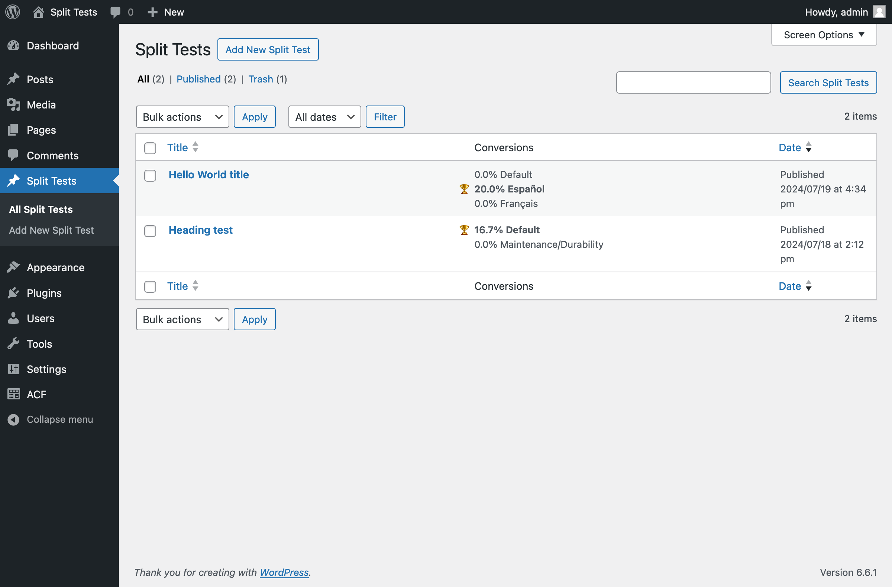
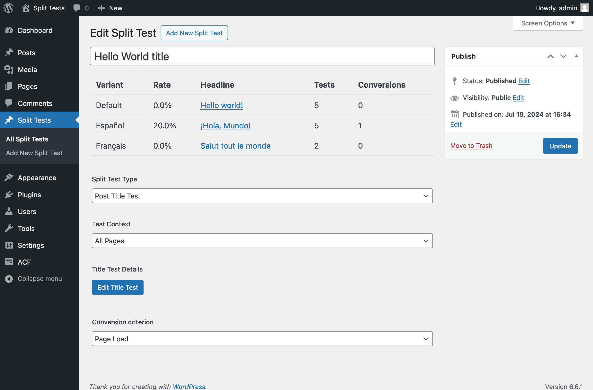
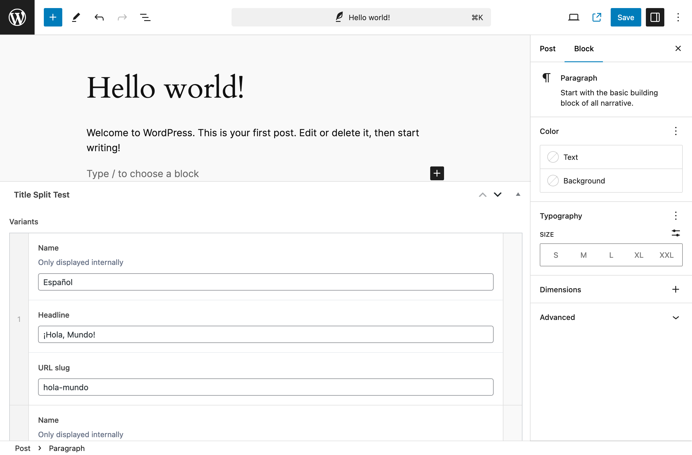

# Split Tests #
Basic A/B testing for WordPress.

## Description ##

A WordPress plugin to add A/B split tests without tracking individual users. Currently there are two kind of tests:

* **Post title tests**: test multiple headlines for a single post.
* **DOM tests**: test arbitrary changes to page content on DOM manipluations.

Depends on [Advanced Custom Fields Pro plugin](https://www.advancedcustomfields.com/pro/), which you will need to install and license separately.

## Installation ##

This section describes how to install the plugin and get it working.

1. Upload `split-tests/` to the `/wp-content/plugins/` directory
1. Activate the plugin through the 'Plugins' menu in WordPress

## Filters ##

- `split_tests_is_headless` - return true from a filter handler if you are using this plugin on headless WordPress (redirects get handled differently).
- `split_tests_endpoint_url` - where JavaScript events should be sent (default is `/wp-admin/admin-ajax.php?action=split_tests`).
- `split_tests_current_url` - used to target on which pages tests will run (default is `$_REQUEST['REQUEST_URI']`).
- `split_tests_is_single` - whether a single post is being loaded (default is the result of `is_single()` only for the `post` post type).
- `split_tests_post_variant` - used internally to modify a post.

## Developer setup ##

This repo contains everything you need to get a test environment setup using the official [WordPress docker image](https://hub.docker.com/_/wordpress).

__Developer dependencies__

* [node.js](https://nodejs.org/) (tested on v22)
* [nvm](https://github.com/nvm-sh/nvm#readme)
* [Docker Desktop](https://www.docker.com/products/docker-desktop)

__Build and start__

        ./bin/build
        ./bin/start

__Local website__

Once you've built and started the docker containers, you can load up the website at [localhost:8080](http://localhost:8080). If you reload the page a couple times, you should see parts of the page change in response to two tests that are set up.

1. **DOM test:** there are two variants for the about text "A commitment to innovation and sustainability" and "A commitment to maintenance and durability". If you click on the "About us" button, that will register as a conversion for a given variant.
2. **Post title:** there are three variants for the Hello World post, if you scroll down to "Watch, Read, Listen" and reload you should see English, Spanish, and French versions of "Hello World." Clicking through to load the post will register as a conversion for that test.

__WordPress admin credentials__

Username: `admin`  
Password: `password`

You can explore the example tests by clicking on [Split Tests](http://localhost:8080/wp-admin/edit.php?post_type=split_test) in the admin sidebar.

## Frequently Asked Questions ##

### Did you say there's no tracking? ###

Yes, we count how many times a test is seen and how many times it converts, but we don't set/read cookies or otherwise attempt to track individual requests.

### How do you define a conversion? ###

There are currently two kinds of conversions: **page loads** and **clicks** (on a specific configured element).

### Does the plugin handle front-end caching? ###

Yes, the tests will work fine with HTML generated behind a CDN, or using other kinds of front-end caching.

## Screenshots ##

### 1. Split Tests posts page ###

### 2. Split Test post editor ###

### 3. Post Title variants ###

## Changelog ##

### 0.1.1 ###
- Adds freeform CSS changes to DOM tests.
- Adds a scroll conversion option.
- Bugfix for title test post selection.

### 0.1.0 ###
- Adds class changes to DOM tests.
- Improves how title tests sync publish status with their associated split test.
- Bugfix for database migrations.
- Bugfix for title test conversions.

### 0.0.9 ###
- Adds a `split_tests_is_headless` filter that changes how redirects are handled.
- Bugfix: don't apply unpublished tests to the site.

### 0.0.8 ###
- Bugfix: allow for zero title tests.

### 0.0.7 ###
- Bugfix: undefined variable in title tests.
- Updates version of `@wordpress/scripts` to latest.

### 0.0.6 ###
- Switch from REST API endpoints to `admin-ajax.php`.
- Adds `split_tests_endpoint_url` and `split_tests_current_url` filters (for headless).
- Click conversions check up the DOM tree for a parent with an `href` attribute if one isn't found on the click event target.
- Fixes a case-sensitivity bug (`DomTests` instead of `DOMTests`).

### 0.0.5 ###
- Filter on `the_title` for post title tests
- Add `split_tests_is_single` hook
- Make JS more headless-friendly

### 0.0.4 ###
Adds a cron mechanism to combine raw events in the database into daily aggregates

### 0.0.3 ###
Context for where tests run ('all', 'home', or a 'url' pattern)

### 0.0.2 ###
Split tests for DOM changes

### 0.0.1 ###
Split tests for post titles